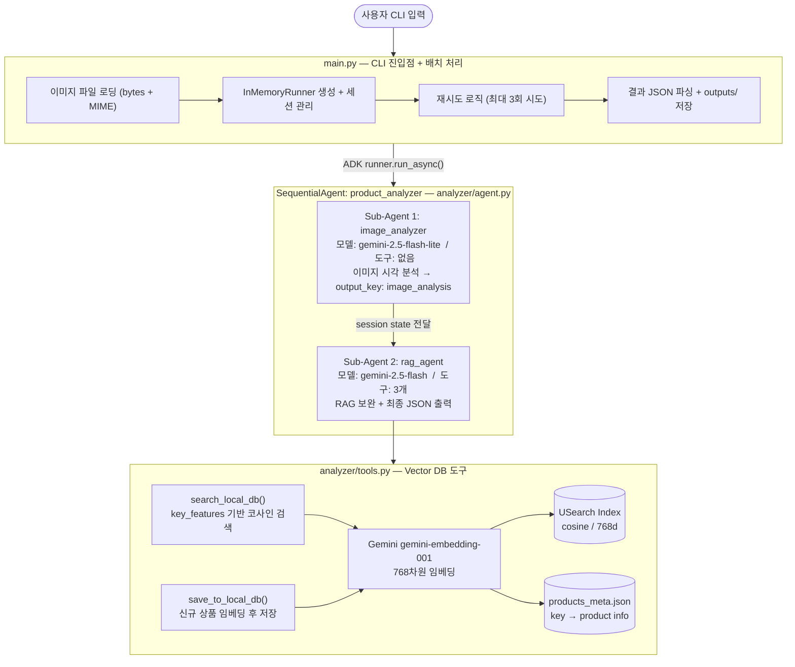
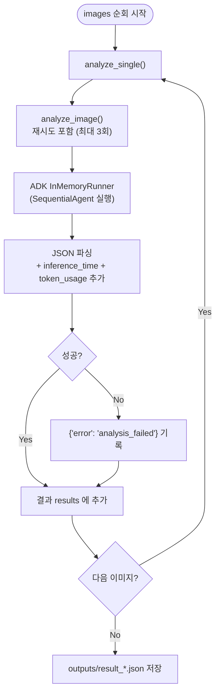
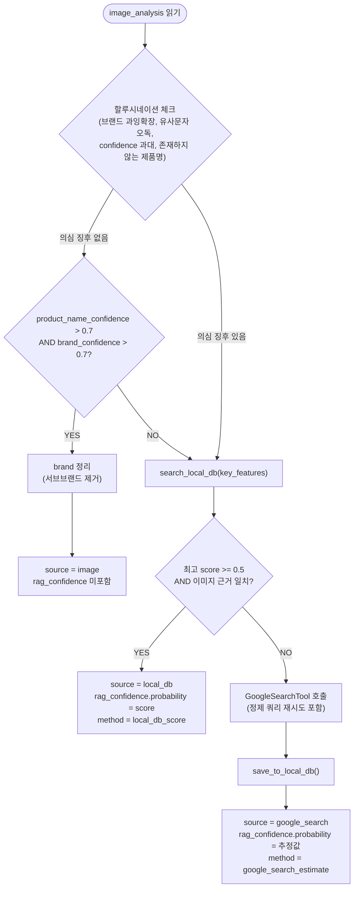
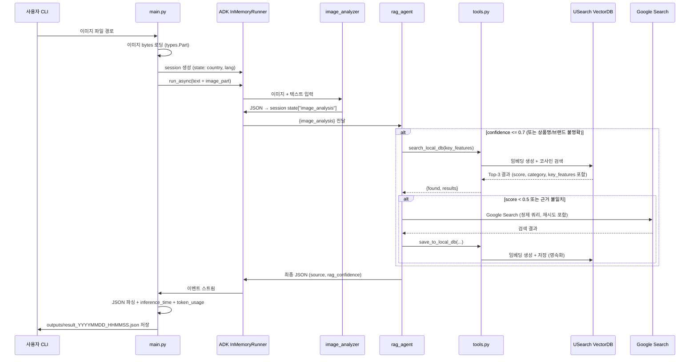
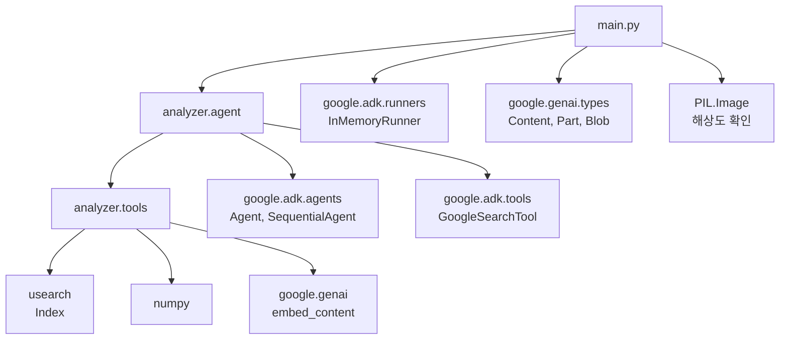

# whatis 아키텍처 문서

## 1. 전체 구조 개요



---

## 2. 컴포넌트별 상세 설명

### 2.1 `main.py` — CLI 진입점

| 역할 | 상세 |
|------|------|
| 인수 파싱 | `image/directory`, `sample_count`, `--country`, `--lang`, `--random` |
| 이미지 로딩 | `load_image_as_part()`: `mimetypes.guess_type()`으로 MIME 자동 감지 후 파일을 `bytes`로 읽어 `types.Part(inline_data=Blob)` 생성 |
| 해상도 출력 | Pillow `Image.open()`으로 WxH 확인 |
| ADK 세션 | `InMemoryRunner` + `session_service.create_session()`, state에 `country/lang` 전달 |
| 이벤트 스트림 | `runner.run_async()` 이벤트를 순회, `author` 변경 시 에이전트 호출 출력, `function_call` 도구 이름 출력 |
| 토큰 집계 | 이벤트의 `usage_metadata`를 누적 합산 |
| 재시도 | `MAX_RETRIES=2`, 3회 시도, `RETRY_DELAY=3`초 대기 |
| 결과 저장 | `outputs/result_YYYYMMDD_HHMMSS.json` 자동 저장 |

**배치 처리 흐름:**



---

### 2.2 `analyzer/agent.py` — 에이전트 정의

#### Sub-Agent 1: `image_analyzer`

```
모델  : gemini-2.5-flash-lite   (저비용, 이미지 분석 특화)
도구  : 없음
입력  : 사용자 메시지 + 이미지 (inline bytes) — country/lang 컨텍스트 포함
출력  : JSON → session state["image_analysis"] 에 저장 (output_key)
```

**출력 스키마:**
```json
{
  "product_name": "Full product name including variant if visible, else ''",
  "product_name_confidence": 0.0,
  "category": "English category (항상 영문)",
  "brand": "최상위 제조사/브랜드명만 (서브브랜드·라인명 제외)",
  "brand_confidence": 0.0,
  "image_features": "시각적 특징 요약 — 단일 문자열 (객체/배열 불가)",
  "key_features": ["고유 텍스트/디자인 사실 (중복 제거, 8~20개)"],
  "expiration_date": "YYYY.MM.DD 또는 빈 문자열"
}
```

> 비상품 이미지인 경우: `{"error": "Unable to identify product image", "description": "reason"}`

**할루시네이션 방지 규칙:**
- **텍스트 판독**: 패키지 텍스트를 글자 그대로 정확히 보고. 애매한 문자는 추측하지 않고 confidence를 ≤ 0.6으로 설정
- **한글 유사 문자 주의**: 요↔려, 삼↔산, 물↔뭘 등 오독 빈발 글자는 불확실하면 낮은 confidence 선택
- **`brand` 필드**: 최상위 제조사/회사명만 기재 (예: "롯데", "CJ제일제당", "오뚜기"). 서브브랜드/라인명은 `product_name` 또는 `key_features`로 이동
  - ✗ "롯데 오늘 온차" → ✓ brand="롯데", product_name에 "오늘 온차" 포함
- **confidence 보수적 운영**: 의심 시 항상 낮은 tier 선택. 1.0은 모든 글자가 100% 명확한 경우에만 사용

**`key_features` dedup 규칙:**
- 중복/유사 항목 통합, 개당 하나의 개념만 포함
- 최소 8개 ~ 최대 20개
- `category`는 항상 영문; 나머지 문자열 필드는 사용자 출력 언어 사용

**신뢰도(confidence) 기준:**
| 값 | 의미 |
|----|------|
| 1.0 | 모든 글자가 100% 명확하고 모호함 없음 (엄격 적용) |
| 0.7–0.9 | 대부분 판독 가능하나 1~2자 약간 불명확 |
| 0.4–0.6 | 상당 부분이 시각 맥락 추론. 불확실 시 이 구간 사용 |
| 0.1–0.3 | 일반적 외형 기반 낮은 확신 |
| 0.0 | 식별 불가 |

---

#### Sub-Agent 2: `rag_agent`

```
모델  : gemini-2.5-flash   (function calling 지원)
도구  : search_local_db, save_to_local_db, GoogleSearchTool(bypass_multi_tools_limit=True)
입력  : {image_analysis} — session state 템플릿 변수
출력  : 최종 JSON (source + rag_confidence 포함)
```

**RAG 판단 로직:**



**할루시네이션 감지 기준 (rag_agent Step 1):**
| 패턴 | 설명 | 조치 |
|------|------|------|
| 브랜드 과잉 확장 | `brand`에 서브브랜드/라인명 포함 (예: "롯데 오늘 온차") | 분리 후 RAG 강제 |
| 한글 유사 문자 오독 | 요↔려, 삼↔산 등 OCR 오류 패턴 | RAG 강제 |
| confidence 과대 | 높은 confidence인데 key_features에 판독 텍스트 적음 | RAG 강제 |
| 존재하지 않는 제품명 | 감지된 브랜드/카테고리에 해당 제품명 패턴 없음 | RAG 강제 |

**`source` 값별 출력 규칙:**

| source | rag_confidence | confidence 값 | 설명 |
|--------|---------------|--------------|------|
| `image` | 미포함 | image_analysis 값 그대로 이관 | 이미지에서 직접 식별 (high confidence) |
| `local_db` | 포함 | `rag_confidence.probability` 값으로 덮어씀 | Vector DB 코사인 유사도 score 직접 사용 |
| `google_search` | 포함 | `rag_confidence.probability` 값으로 덮어씀 | 근거 일치도 기반 0~1 추정값 |

---

#### `root_agent` — SequentialAgent

```python
root_agent = SequentialAgent(
    name="product_analyzer",
    description="상품 이미지를 분석하여 상품 정보를 알려주는 에이전트",
    sub_agents=[image_analyzer, rag_agent],
)
```

ADK `SequentialAgent`는 sub_agents를 순서대로 실행하며, 이전 에이전트의 `output_key` 결과가 session state를 통해 다음 에이전트에 전달됩니다.

---

### 2.3 `analyzer/tools.py` — Vector DB 도구

#### 스토리지 구조

```
datasets/vectordb/
├── products.usearch       # USearch 바이너리 벡터 인덱스
│                          # ndim=768, metric="cos"
└── products_meta.json     # 메타데이터
    {
      "next_key": 42,
      "products": {
        "0": { "product_name": ..., "brand": ..., "key_features": [...], ... },
        "1": { ... },
        ...
      }
    }
```

- **키(key)**: 자동 증가 정수 (`next_key`), USearch index와 meta JSON이 동일한 키로 연동
- **인덱스**: 메모리에 싱글턴으로 유지 (`_index`, `_meta` 전역 변수), 최초 조회 시 디스크에서 로드

---

#### `_get_embedding(texts)` — 임베딩 생성

```
Gemini API: gemini-embedding-001
출력 차원: 768
입력: 텍스트 리스트 (batch)
재시도: 최대 2회 (RETRY_DELAY=3초)
```

---

#### `search_local_db(key_features)` → str (JSON)

```
1. key_features 리스트를 공백으로 join → 쿼리 문자열
2. Gemini로 768차원 임베딩 생성
3. USearch index.search(query_vec, n=3) — Top-3 코사인 검색
4. score = 1.0 - cosine_distance  (코사인 유사도)
5. score < 0.3 인 결과 필터링 (사전 제거)
6. 매칭 있으면 {"found": true, "results": [...]} 반환
   매칭 없으면 {"found": false, "message": "..."} 반환
```

> **결과 항목 필드**: `product_name`, `brand`, `category`, `key_features`, `score`

> **rag_agent의 최종 채택 기준**: `score >= 0.5` AND 이미지 근거 일치 시 사용, 미달 시 Google Search 진행

---

#### `save_to_local_db(product_name, brand, category, key_features, source, country, lang)` → str (JSON)

```
1. 중복 체크: 동일 product_name + brand 존재 시 저장 생략
2. key_features 임베딩 생성
3. index.add(next_key, vector)
4. meta["products"][key] = { 상품 정보 + uuid + created_at }
5. next_key 증가
6. index.save() + meta JSON 저장 (영속화)
```

---

#### 마이그레이션 (`_migrate_json_db`)

`_get_index()` 초기화 시 인덱스 로딩 조건:
- `products.usearch` 존재 **AND** `products_meta.json`에 products 데이터 있으면 → 디스크에서 로드
- products가 비어 있으면 → `datasets/products_db.json`이 존재할 경우 자동 마이그레이션 실행

이후 실행에서는 `products_meta.json`에 데이터가 있으면 마이그레이션을 건너뜁니다.

---

## 3. 데이터 흐름 (End-to-End)



---

## 4. 출력 JSON 스키마

```json
{
  "product_name": "상품명",
  "product_name_confidence": 0.85,
  "category": "Food",
  "brand": "브랜드명",
  "brand_confidence": 0.90,
  "image_features": "시각적 특징 요약",
  "key_features": ["키워드1", "키워드2"],
  "expiration_date": "2025.12.31",
  "source": "local_db",
  "rag_confidence": {
    "probability": 0.72,
    "method": "local_db_score",
    "evidence": "key_features 일치도 기반"
  },
  "inference_time": "6.42s",
  "token_usage": {
    "input_tokens": 1200,
    "output_tokens": 350,
    "total_tokens": 1550
  }
}
```

| 필드 | source=image | source=local_db | source=google_search |
|------|:---:|:---:|:---:|
| `rag_confidence` | ✗ | ✓ | ✓ |
| `rag_confidence.method` | — | `local_db_score` | `google_search_estimate` |

---

## 5. 모듈 의존 관계



---

## 6. 설정 및 환경 변수

| 항목 | 값 | 위치 |
|------|----|----|
| `GOOGLE_API_KEY` | Google AI Studio API 키 | `.env` |
| `EMBEDDING_MODEL` | `gemini-embedding-001` | `tools.py` 상수 |
| `EMBEDDING_DIM` | `768` | `tools.py` 상수 |
| `MAX_RETRIES` | `2` (3회 시도) | `tools.py`, `main.py` |
| `RETRY_DELAY` | `3`초 | `tools.py`, `main.py` |
| Vector DB 경로 | `datasets/vectordb/` | `tools.py` 상수 |
| `IMAGE_EXTENSIONS` | `.jpg .jpeg .png .gif .webp .bmp .tiff` | `main.py` 상수 |
| local_db 채택 임계값 | `score >= 0.5` (사전 필터: `< 0.3` 제거) | `rag_agent` 프롬프트 |

---

## 7. 주요 설계 결정 사항

### 7.1 2-Agent 분리 (flash-lite + flash)
- `gemini-2.5-flash-lite`는 function calling을 지원하지 않지만 이미지 분석에는 도구가 불필요
- 비용이 높은 `gemini-2.5-flash`는 RAG/검색 단계에서만 사용하여 비용 절감

### 7.2 session state를 통한 에이전트 간 데이터 전달
- `image_analyzer`의 `output_key="image_analysis"` → session state에 저장
- `rag_agent` 프롬프트의 `{image_analysis}` 템플릿 변수로 참조

### 7.3 Vector DB (USearch + Gemini Embedding)
- 기존 키워드 집합 교집합 방식 → 의미 기반 검색(semantic search)으로 전환
- 코사인 유사도 기반이므로 "초콜릿" → "초코파이" 같은 의미 유사 매칭 가능
- score < 0.3 사전 필터링으로 무관한 결과 차단, rag_agent는 score >= 0.5 기준으로 최종 채택 결정

### 7.4 Google Search → 자동 DB 저장 (RAG 누적)
- Google Search로 찾은 상품 정보를 `save_to_local_db()`로 즉시 저장
- 이후 동일 상품 분석 시 Google Search 없이 local_db에서 처리 (비용 절감, 속도 향상)

### 7.5 배치 단위 예외 격리
- 이미지 하나 실패 시 `{"error": "analysis_failed"}` 기록 후 다음 이미지 계속 처리
- 전체 배치 실행이 단일 실패로 중단되지 않음
