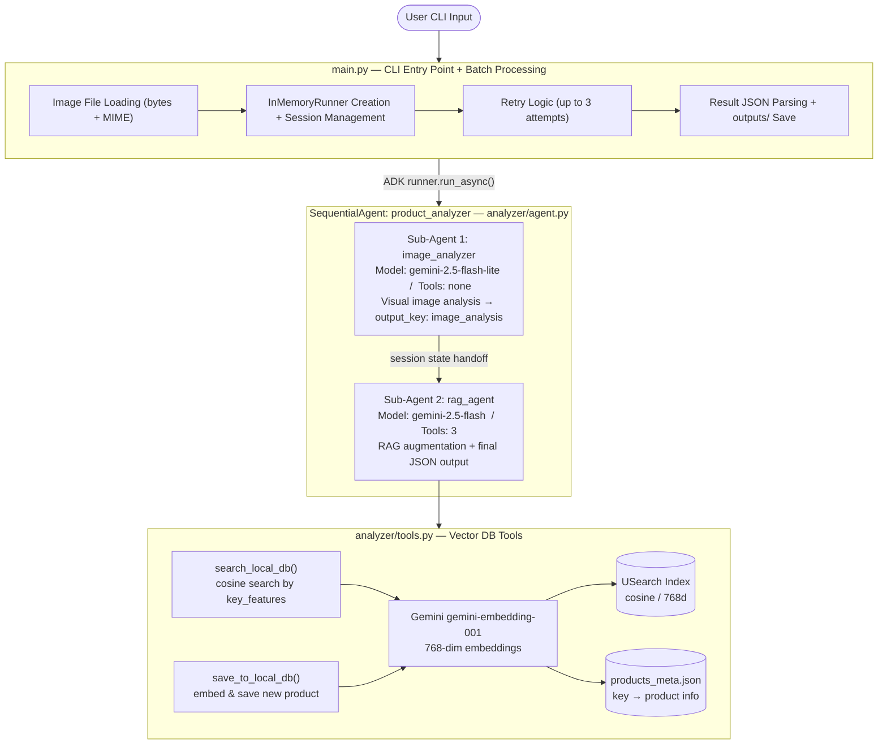
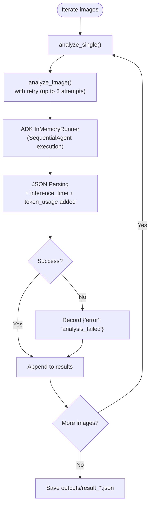
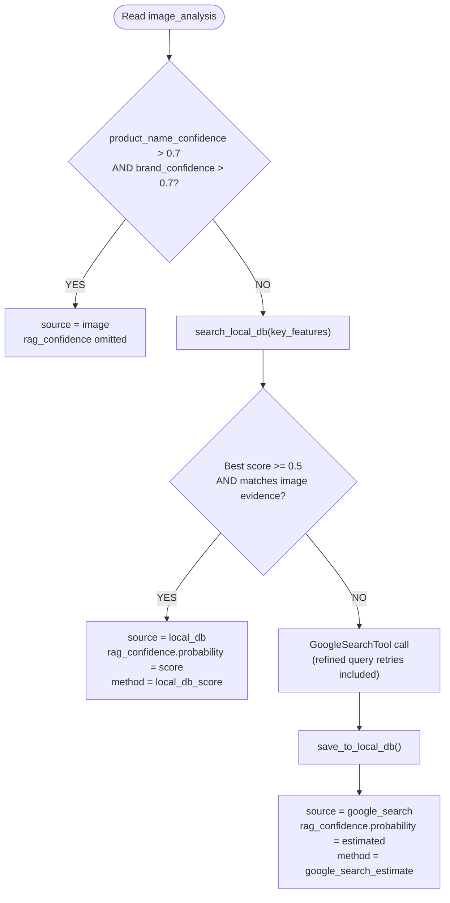
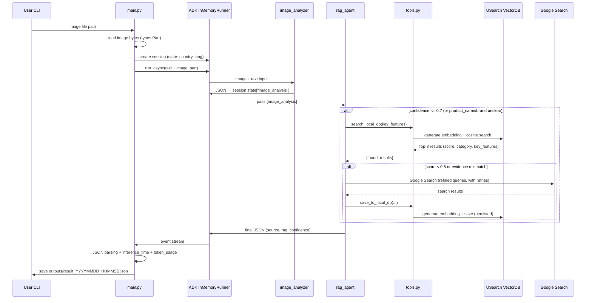
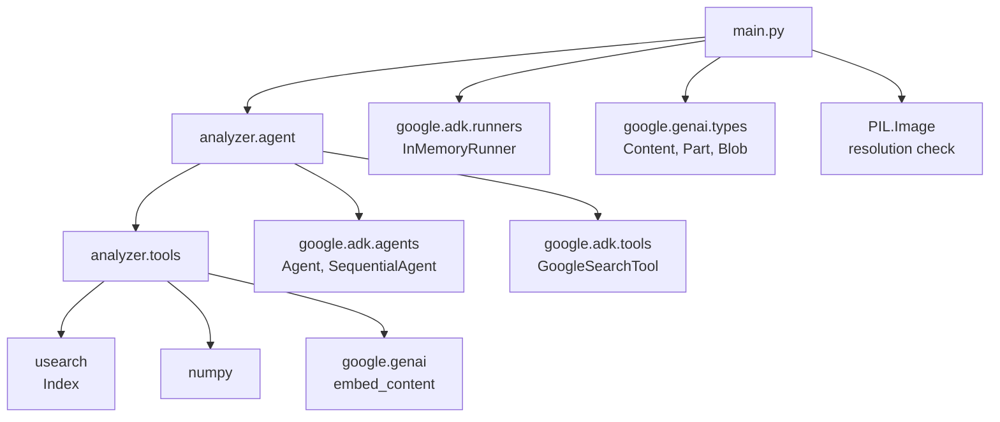

# whatis Architecture

## 1. System Overview



---

## 2. Component Details

### 2.1 `main.py` — CLI Entry Point

| Role | Details |
|------|---------|
| Argument Parsing | `image/directory`, `sample_count`, `--country`, `--lang`, `--random` |
| Image Loading | `load_image_as_part()`: auto-detects MIME type via `mimetypes.guess_type()`, reads file as `bytes`, creates `types.Part(inline_data=Blob)` |
| Resolution Display | Pillow `Image.open()` to get WxH |
| ADK Session | `InMemoryRunner` + `session_service.create_session()`, passes `country/lang` in state |
| Event Stream | Iterates `runner.run_async()` events; prints agent name on `author` change, prints tool name on `function_call` |
| Token Aggregation | Accumulates `usage_metadata` across events (`candidates_token_count`) |
| Retry | `MAX_RETRIES=2`, 3 total attempts, `RETRY_DELAY=3`s between retries |
| Result Save | Auto-saves to `outputs/result_YYYYMMDD_HHMMSS.json` |

**Batch Processing Flow:**



---

### 2.2 `analyzer/agent.py` — Agent Definitions

#### Sub-Agent 1: `image_analyzer`

```
Model   : gemini-2.5-flash-lite   (low-cost, optimized for image analysis)
Tools   : none
Input   : user message + image (inline bytes) — includes country/lang context
Output  : JSON → saved to session state["image_analysis"] via output_key
```

**Output Schema:**
```json
{
  "product_name": "Full product name including variant if visible, else ''",
  "product_name_confidence": 0.0,
  "category": "English category (always in English)",
  "brand": "Brand name or ''",
  "brand_confidence": 0.0,
  "image_features": "Visual summary — single string (never object/array)",
  "key_features": ["Unique text/design facts (deduped, 8~20 items)"],
  "expiration_date": "YYYY.MM.DD or empty string"
}
```

> For non-product images: `{"error": "Unable to identify product image", "description": "reason"}`

**`key_features` Dedup Rules:**
- Merge near-duplicates into one normalized item; one concept per item
- Minimum 8 items, maximum 20 items
- `category` is always in English; all other string fields use the user's output language

**Confidence Guide:**
| Value | Meaning |
|-------|---------|
| 1.0 | Text/logo clearly readable in image |
| 0.7–0.9 | Partially obscured or blurry but high confidence |
| 0.4–0.6 | Inferred from packaging style/colors/visual context |
| 0.1–0.3 | Weak guess based on general appearance |
| 0.0 | Cannot identify |

---

#### Sub-Agent 2: `rag_agent`

```
Model   : gemini-2.5-flash   (supports function calling)
Tools   : search_local_db, save_to_local_db, GoogleSearchTool(bypass_multi_tools_limit=True)
Input   : {image_analysis} — session state template variable
Output  : final JSON (includes source + rag_confidence)
```

**RAG Decision Logic:**



**`source` Output Rules:**

| source | rag_confidence | Confidence Value | Description |
|--------|---------------|-----------------|-------------|
| `image` | omitted | carried over from image_analysis unchanged | Identified directly from image (high confidence) |
| `local_db` | included | overwritten with `rag_confidence.probability` | Vector DB cosine similarity score used directly |
| `google_search` | included | overwritten with `rag_confidence.probability` | 0~1 estimated value based on evidence match |

---

#### `root_agent` — SequentialAgent

```python
root_agent = SequentialAgent(
    name="product_analyzer",
    description="상품 이미지를 분석하여 상품 정보를 알려주는 에이전트",
    sub_agents=[image_analyzer, rag_agent],
)
```

The ADK `SequentialAgent` runs sub_agents in order. The previous agent's `output_key` result is passed to the next agent via session state.

---

### 2.3 `analyzer/tools.py` — Vector DB Tools

#### Storage Structure

```
datasets/vectordb/
├── products.usearch       # USearch binary vector index
│                          # ndim=768, metric="cos"
└── products_meta.json     # Metadata
    {
      "next_key": 42,
      "products": {
        "0": { "product_name": ..., "brand": ..., "key_features": [...], ... },
        "1": { ... },
        ...
      }
    }
```

- **Key**: Auto-incrementing integer (`next_key`), same key used in both USearch index and meta JSON
- **Index**: Maintained as a singleton in memory (`_index`, `_meta` globals), loaded from disk on first access

---

#### `_get_embedding(texts)` — Embedding Generation

```
Gemini API: gemini-embedding-001
Output dimensions: 768
Input: list of texts (batch)
Retry: up to 2 retries (RETRY_DELAY=3s)
```

---

#### `search_local_db(key_features)` → str (JSON)

```
1. Join key_features list with spaces → query string
2. Generate 768-dim embedding via Gemini
3. USearch index.search(query_vec, n=3) — Top-3 cosine search
4. score = 1.0 - cosine_distance  (cosine similarity)
5. Filter out results with score < 0.3 (pre-filter)
6. If matched: {"found": true, "results": [...]}
   If not: {"found": false, "message": "..."}
```

> **Result item fields**: `product_name`, `brand`, `category`, `key_features`, `score`

> **rag_agent adoption threshold**: uses result if `score >= 0.5` AND matches image evidence; otherwise proceeds to Google Search

---

#### `save_to_local_db(product_name, brand, category, key_features, source, country, lang)` → str (JSON)

```
1. Duplicate check: skip if same product_name + brand already exists
2. Generate key_features embedding
3. index.add(next_key, vector)
4. meta["products"][key] = { product info + uuid + created_at }
5. Increment next_key
6. index.save() + meta JSON save (persistence)
```

---

#### Migration (`_migrate_json_db`)

`_get_index()` initialization loading conditions:
- `products.usearch` exists **AND** `products_meta.json` has product data → load from disk
- Products are empty → runs auto-migration from `datasets/products_db.json` if it exists

On subsequent runs, migration is skipped if `products_meta.json` already contains data.

---

## 3. End-to-End Data Flow



---

## 4. Output JSON Schema

```json
{
  "product_name": "Product name",
  "product_name_confidence": 0.85,
  "category": "Food",
  "brand": "Brand name",
  "brand_confidence": 0.90,
  "image_features": "Visual characteristic summary",
  "key_features": ["keyword1", "keyword2"],
  "expiration_date": "2025.12.31",
  "source": "local_db",
  "rag_confidence": {
    "probability": 0.72,
    "method": "local_db_score",
    "evidence": "key_features match summary"
  },
  "inference_time": "6.42s",
  "token_usage": {
    "input_tokens": 1200,
    "output_tokens": 350,
    "total_tokens": 1550
  }
}
```

| Field | source=image | source=local_db | source=google_search |
|-------|:---:|:---:|:---:|
| `rag_confidence` | ✗ | ✓ | ✓ |
| `rag_confidence.method` | — | `local_db_score` | `google_search_estimate` |

---

## 5. Module Dependency Graph



---

## 6. Configuration & Environment Variables

| Item | Value | Location |
|------|-------|----------|
| `GOOGLE_API_KEY` | Google AI Studio API key | `.env` |
| `EMBEDDING_MODEL` | `gemini-embedding-001` | `tools.py` constant |
| `EMBEDDING_DIM` | `768` | `tools.py` constant |
| `MAX_RETRIES` | `2` (3 total attempts) | `tools.py`, `main.py` |
| `RETRY_DELAY` | `3` seconds | `tools.py`, `main.py` |
| Vector DB path | `datasets/vectordb/` | `tools.py` constant |
| `IMAGE_EXTENSIONS` | `.jpg .jpeg .png .gif .webp .bmp .tiff` | `main.py` constant |
| local_db adoption threshold | `score >= 0.5` (pre-filter: removes `< 0.3`) | `rag_agent` prompt |

---

## 7. Key Design Decisions

### 7.1 Two-Agent Split (flash-lite + flash)
- `gemini-2.5-flash-lite` does not support function calling, but no tools are needed for image analysis
- The more expensive `gemini-2.5-flash` is used only for the RAG/search phase, reducing costs

### 7.2 Inter-Agent Data via Session State
- `image_analyzer` stores its output in session state via `output_key="image_analysis"`
- `rag_agent` accesses it through the `{image_analysis}` template variable in its prompt

### 7.3 Vector DB (USearch + Gemini Embedding)
- Replaced keyword intersection approach with semantic search
- Cosine similarity enables meaning-based matches like "chocolate" → "Choco Pie"
- Pre-filter removes results with score < 0.3; rag_agent adopts results only at score >= 0.5

### 7.4 Google Search → Auto DB Save (RAG Accumulation)
- Products found via Google Search are immediately saved with `save_to_local_db()`
- Subsequent analysis of the same product resolves from local_db without Google Search (cost reduction, speed improvement)

### 7.5 Per-Image Exception Isolation
- If one image fails, `{"error": "analysis_failed"}` is recorded and the batch continues
- A single failure does not abort the entire batch run
